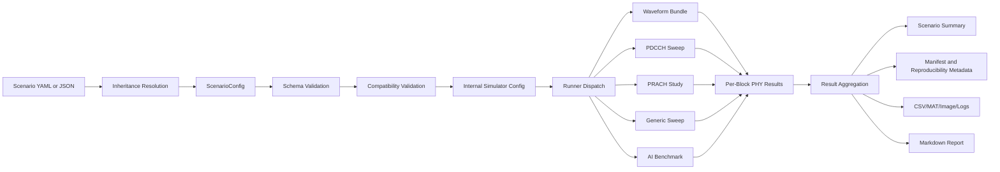

# 6G PHY LLS Simulator Architecture

## Scope

This architecture defines a production-grade, fully config-driven 6G PHY link-level simulator for laboratory use. It is designed to support:

- NR-like baseline benchmarking
- agreed benchmark starting points
- 6G study-item candidate features
- optional lab-specific research experiments

The simulator is research-oriented, but it must remain reproducible, auditable, and structured like a production system.

## Module Boundaries

| Layer | Responsibility | Primary Surfaces |
|---|---|---|
| Front Door | Accept config path, output dir, run tag, log level only | `run_6g_phy_lls_single.m`, `run_6g_phy_lls_matrix.m` |
| Config Ingestion | Read YAML/JSON, resolve inheritance, create canonical `ScenarioConfig` | `+sixgr/+lls6g/+config/loadScenarioConfig.m`, `+sixgr/+lls6g/+config/ScenarioConfig.m` |
| Schema and Validation | Reject unknown keys, enforce types/ranges/enums, apply dependency rules | `+sixgr/+lls6g/+config/schema.m`, `+sixgr/+lls6g/+config/validateScenarioConfig.m` |
| Catalog Layer | Hold allowed values, ranges, classification, and schema policy in YAML | `simulator/configs/schema/*.yaml` |
| Config Translation | Convert resolved `ScenarioConfig` into internal simulator config without hidden defaults | `+sixgr/+lls6g/buildInternalConfig.m` |
| Scenario Execution | Dispatch to waveform-bundle, PDCCH sweep, PRACH study, generic sweep, AI benchmark | `+sixgr/+lls6g/+runners/runSingle.m`, `+sixgr/+lls6g/+runners/runMatrix.m` |
| PHY Execution | Execute DL/UL waveform chains, RS generation, PRACH, control, HARQ, and measurements | `+sixgr/+truth/runWaveformLinkBundle.m`, `+sixgr/+phy/*`, `+sixgr/+link/*` |
| Result Aggregation | Build scenario summary, manifest, sweep summary, KPI tables, case status | `+sixgr/+lls6g/+runners/runSingle.m`, `+sixgr/+truth/runWaveformLinkBundle.m` |
| Artifact Writing | Write metadata, CSV, MAT, images, logs, reports, and structured folders | `+sixgr/+report/resultLayout.m`, `+sixgr/+report/defaultRunFolder.m`, `+sixgr/+link/exportLinkKPIs.m` |

## End-to-End Data Flow

## Configuration Ingestion

The ingestion path is:

1. Read the user-provided scenario or matrix file.
2. Resolve the `inherits` chain in deterministic order.
3. Merge later layers over earlier layers.
4. Build a resolved `ScenarioConfig`.
5. Validate the resolved object before any simulation work starts.

### Required Inheritance Order

1. global defaults
2. release/profile defaults
3. band pack
4. waveform pack
5. channel pack
6. MIMO/beam pack
7. reference-signal pack
8. AI/ML pack
9. impairment pack
10. energy-efficiency pack
11. scenario override
12. sweep/matrix override

## Validation Pipeline

Validation is mandatory and happens in two stages:

1. Structural validation
   - top-level sections
   - required keys
   - unknown-key rejection
   - type/range/enum checks
2. Compatibility validation
   - cross-field dependencies
   - invalid combinations
   - candidate-feature gating
   - scenario runner compatibility
   - reproducibility completeness

Typical fail-fast examples:

- `frame.scs_khz` not allowed by `frequency.numerology_options_khz`
- `frequency.bandwidth_hz` not allowed by `frequency.bandwidth_options_hz`
- UL `DFT-s-OFDM` with `transform_precoding_enabled=false`
- `data_code_type='POLAR'` on data channels
- AI enabled without `model_id`, `model_version`, `descriptor_type`, or `model_path`

## Execution Pipeline

## Single-Scenario Run

1. `run_6g_phy_lls_single` accepts the config path and output root.
2. `runSingle` loads the scenario config and applies deterministic randomness.
3. `defaultRunFolder` allocates the canonical results location.
4. `resultLayout` creates the structured result tree.
5. `buildInternalConfig` maps the validated scenario into the internal simulator cfg.
6. The selected `scenario.runner_profile` is dispatched.
7. Results are annotated, summarized, written, and pruned.

## Matrix Run

1. `run_6g_phy_lls_matrix` validates the matrix file.
2. A matrix root is created under `results/lls/<matrix_id>/<leaf>`.
3. Each scenario path is resolved and executed through `runSingle`.
4. Combined summary, matrix manifest, and per-run folders are written.
5. Optional parallel execution is allowed only for independent scenarios.

## Scenario Runner Profiles

| Runner Profile | Purpose | Main Output Surface |
|---|---|---|
| `waveform_bundle` | Full DL/UL PHY bundle with RS/control/beam outputs | `air_interface/`, `control/`, `beamforming/` |
| `pdcch_blind_decode_sweep` | Control-channel monitoring and aggregation study | `control/csv/` |
| `prach_detection` | PRACH detection/false-alarm/miss study | `control/csv/` |
| `generic_sweep` | Native sweep wrapper for scenario overrides | `reports/csv/sweep_summary.csv` plus sub-runs |
| `ai_benchmark` | AI/ML performance and fallback study | `reports/`, AI metadata, optional KPI tables |

## Result Aggregation Responsibilities

The aggregation layer must produce:

- `scenario_summary.csv`
- `scenario_manifest.json`
- `scenario_report.md`
- optional `scenario_result.mat`
- per-block KPI tables
- per-trial debug tables
- sweep summaries when applicable
- validation and reproducibility metadata

Aggregation must preserve:

- scenario ID
- config hash
- runner profile
- run scope
- run completion
- feature class tags
- deterministic-mode state
- seed information

## Artifact Writer Responsibilities

Artifacts are written through the canonical layout described in [docs/result_output_layout.md](../result_output_layout.md).

Core directories for an LLS run are:

- `meta/`
- `reports/csv`
- `reports/mat`
- `reports/image`
- `logs/`
- `air_interface/csv`
- `air_interface/mat`
- `air_interface/image`
- `control/csv`
- `control/image`
- `beamforming/csv`
- `beamforming/image`
- optional `packet_flow/`, `rf/`, `numerology/`, and other analysis folders when enabled

## Artifact Ownership

| Artifact | Owner |
|---|---|
| Resolved config snapshots | `runSingle`, `runMatrix` |
| Manifest and reproducibility metadata | `runSingle`, `runMatrix` |
| Air-interface KPI exports | `+sixgr/+truth/runWaveformLinkBundle.m`, `+sixgr/+link/exportLinkKPIs.m` |
| Control-plane traces | `+sixgr/+truth/exportControlPlaneTraces.m` |
| Layout and path hygiene | `+sixgr/+report/defaultRunFolder.m`, `+sixgr/+report/resultLayout.m` |
| Markdown reports | `runSingle` |

## Determinism Contract

Every executed module must consume the same resolved config and seed state. No module is allowed to:

- use ad hoc environment variables to alter PHY behavior
- keep hidden simulation defaults that materially affect outcomes
- emit results without run-scope and configuration provenance

## Design Separation

The architecture keeps four categories separate:

- `baseline_benchmark`
- `agreed_starting_point`
- `study_item_candidate`
- `optional_research_experiment`

This separation must be preserved in:

- config files
- manifests
- scenario library descriptions
- validation gating
- reports
