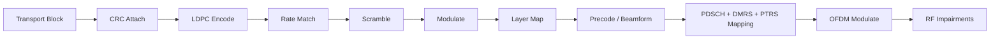
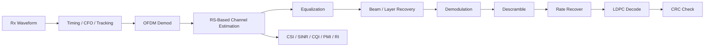
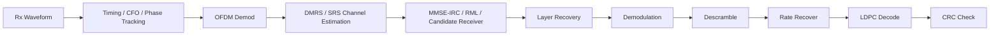
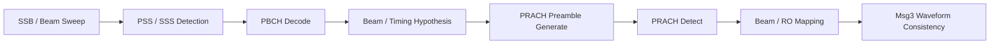
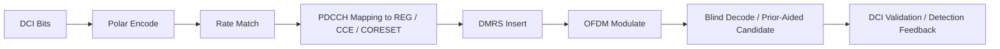
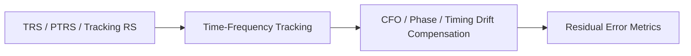
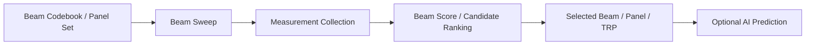
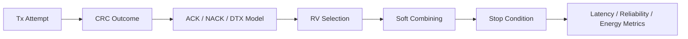
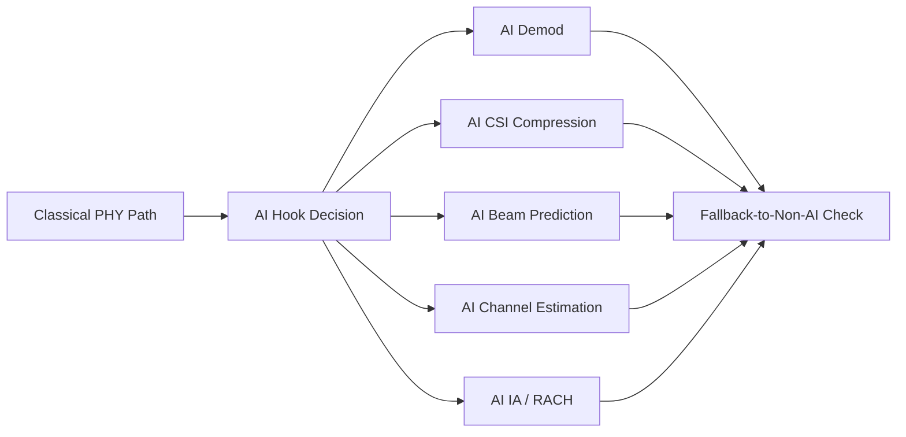
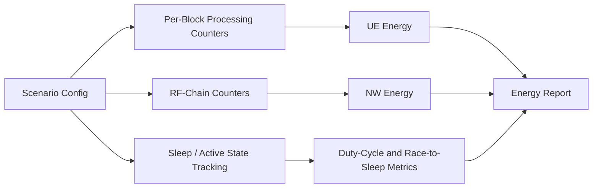

# 6G PHY LLS Block Diagrams and Parameter Lists

The exact ordered chains that back these block diagrams are now carried in the machine-readable top-level config section `processing_chains`. See [processing_chains.md](processing_chains.md) for the normative ordered lists and config bindings.

## DL Tx Chain



Primary parameters:

- `coding.*`
- `modulation.*`
- `mimo.*`
- `reference_signals.*`
- `waveform.*`
- `impairments.*`

## DL Rx Chain



Primary parameters:

- `reference_signals.channel_estimation_mode`
- `reference_signals.receiver_example`
- `impairments.*`
- `ai_ml.*` for AI-assisted estimation or demod
- `kpis.*`

## UL Tx Chain


Primary parameters:

- `waveform.ul_waveform`
- `waveform.transform_precoding_enabled`
- `waveform.low_papr_mode`
- `waveform.noncontiguous_mapping_enabled`
- `modulation.pi2_bpsk_enabled`
- `reference_signals.pusch_dmrs_ports`
- `reference_signals.srs_*`

## UL Rx Chain



Primary parameters:

- `reference_signals.receiver_example`
- `reference_signals.channel_estimation_mode`
- `channels.*`
- `impairments.*`
- `ai_ml.use_case=channel_estimation`

## Initial Access / PRACH Chain



Primary parameters:

- `reference_signals.ssb_enabled`
- `reference_signals.pbch_enabled`
- `random_access.*`
- beam mapping and repetition fields
- candidate AI/ML beam prediction fields

## CSI Acquisition / Reporting Chain

```mermaid
flowchart LR
    A[CSI-RS / DMRS / SRS] --> B[Channel Estimation]
    B --> C[Noise / Interference Estimation]
    C --> D[Codebook and CRI Candidate Generation]
    D --> E[CSI Compression / Selection]
    E --> F[CQI / PMI(Type1/Type2/eType2) / RI / CRI / Candidate CSI Payload]
    F --> G[Feedback or Reciprocity Use]
```

Primary parameters:

- `reference_signals.csi_rs_enabled`
- `reference_signals.srs_enabled`
- `reference_signals.csi_acquisition_mode`
- `reference_signals.operation_orientation`
- `reference_signals.srs_ports`
- `reference_signals.srs_periodicity_ms`
- `reference_signals.sgcs_reporting_enabled`
- `reference_signals.nmse_reporting_enabled`
- `ai_ml.use_case=csi_feedback`

## Control Channel Chain



Primary parameters:

- `control.search_space_type`
- `control.aggregation_levels`
- `control.dci_formats`
- `control.blind_decode_candidates`
- `control.coreset_duration`
- `control.coreset_frequency_resources`
- repetition, higher-AL, multi-stage, and prior-aided candidate fields

## Tracking RS Chain



Primary parameters:

- `reference_signals.trs_enabled`
- `reference_signals.tracking_rs_enabled`
- `reference_signals.ptrs_enabled`
- `impairments.cfo_hz`
- oscillator drift and initial-acquisition packs

## Beam Management Chain



Primary parameters:

- `mimo.n_tx_ant`, `mimo.n_rx_ant`, `mimo.n_layers`
- `mimo.precoder_type`
- `mimo.beam_sweep_enabled`
- `mimo.beam_count`
- `mimo.panel_count`
- `mimo.multi_panel_ready`
- `mimo.trp_count`
- `mimo.precoding_granularity`
- `ai_ml.use_case=beam_prediction`

## HARQ Chain



Primary parameters:

- `harq.enabled`
- `harq.process_count`
- `harq.rv_sequence`
- `harq.feedback_timing_slots`
- `harq.combining_mode`
- `harq.cbg_enabled`
- feedback-efficiency and PDCCH-miss-related behavior fields

## AI/ML Hooks



Primary parameters:

- `ai_ml.enabled`
- `ai_ml.use_case`
- `ai_ml.mode`
- `ai_ml.model_id`
- `ai_ml.model_version`
- `ai_ml.model_path`
- `ai_ml.fallback_to_non_ai_enabled`
- `ai_ml.download_mode`
- `ai_ml.benchmark_observations`

## Energy / Complexity Instrumentation Chain



Primary parameters:

- `energy_efficiency.tx_power_dbm`
- per-block processing energy controls
- RF-chain energy controls
- bandwidth adaptation controls
- PDCCH monitoring adaptation
- blind-decoding reduction
- active/sleep duty-cycle tracking
- wideband vs narrowband trade-off controls

## Parameter Ownership Summary

| Chain | Primary Sections |
|---|---|
| DL Tx | `coding`, `modulation`, `mimo`, `reference_signals`, `waveform`, `impairments` |
| DL Rx | `reference_signals`, `channels`, `impairments`, `ai_ml`, `kpis` |
| UL Tx | `waveform`, `modulation`, `coding`, `reference_signals`, `mimo`, `energy_efficiency` |
| UL Rx | `reference_signals`, `channels`, `impairments`, `ai_ml`, `harq` |
| Initial access | `reference_signals`, `random_access`, `mimo`, `ai_ml` |
| CSI | `reference_signals`, `mimo`, `csi_acquisition_and_reporting`, `ai_ml`, `kpis` |
| Control | `control`, `reference_signals`, `coding`, `harq` |
| Tracking RS | `reference_signals`, `impairments`, `channels` |
| Beam management | `mimo`, `reference_signals`, `ai_ml`, `channels` |
| HARQ | `harq`, `control`, `coding`, `kpis` |
| AI/ML hooks | `ai_ml`, `kpis`, `logging` |
| Energy instrumentation | `energy_efficiency`, `kpis`, `logging` |
