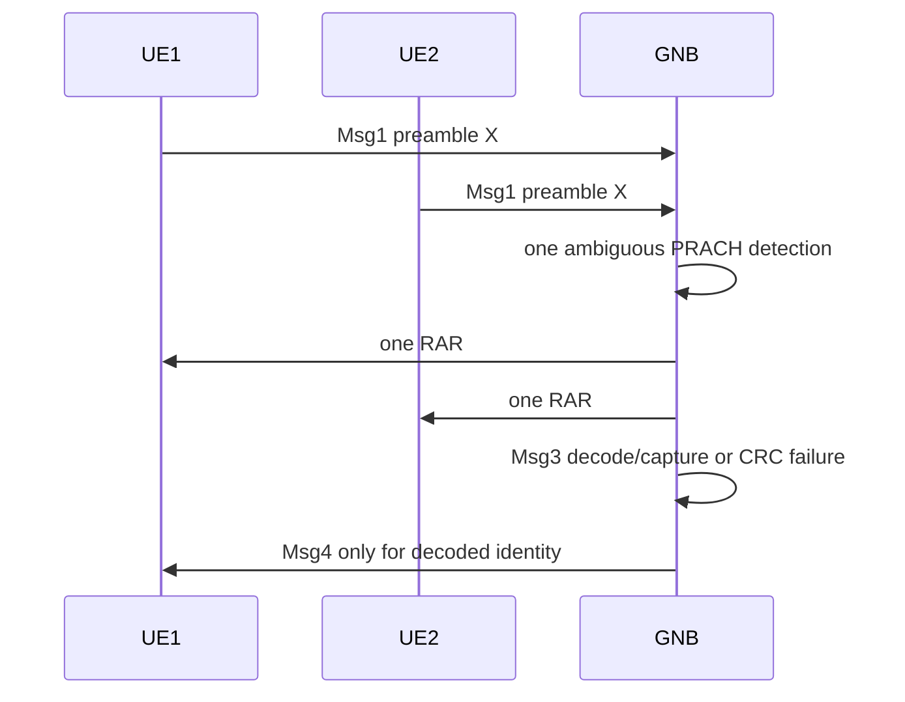

# Phase 4 Collision Handling

Same-preamble collision must not be falsely separated at PRACH. A same-preamble
collision is ambiguous until later message processing provides independently
decoded evidence.

## Production Path

- `+sixgr/+phy/+ra/runFourStepRA.m`
- `+sixgr/+phy/+ra/detectMsg1PRACH.m`
- `+sixgr/+phy/+ra/recoverMsg3PUSCH.m`
- `+sixgr/+phy/+ra/recoverMsg4Waveform.m`

## Evidence

- `control/csv/ra_collision_trials.csv`
- `control/csv/ra_negative_trials.csv`
- `control/csv/msg1_prach_detection.csv`
- `control/csv/msg3_pusch_trials.csv`
- `control/csv/msg4_contention_resolution.csv`

## Collision Flow

## Tests

- `testRACollisionSamePreamble`
- `testPRACHCollisionAndMultiPreamble`

## Current Status

Same-preamble collision fails explicitly in the strict anchor. Full mobile
two-UE CDL/RF capture lineage remains pending.
