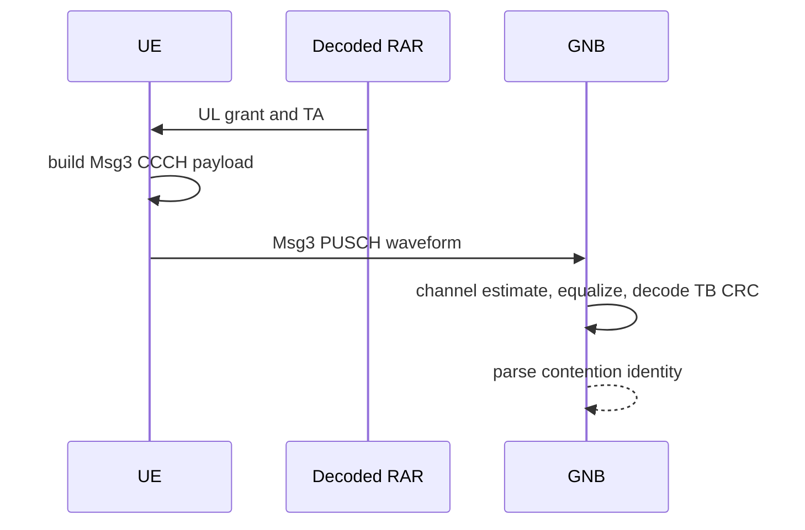

# Phase 4 Msg3 Chain

Msg3 carries the UE contention identity in an anchor RRCSetupRequest/UL-CCCH
payload over PUSCH. Its resources come from the decoded RAR UL grant.

## Production Path

- `+sixgr/+mac/+ra/buildMsg3Payload.m`
- `+sixgr/+phy/+ra/generateMsg3PUSCHWaveform.m`
- `+sixgr/+phy/+ra/recoverMsg3PUSCH.m`
- `+sixgr/+mac/+ra/parseMsg3Payload.m`

## Evidence

- `control/csv/msg3_pusch_trials.csv`
- `reports/json/msg3_payload_decoded.json`
- `reports/image/msg3_pusch_constellation.png`
- `control/csv/ra_attempts.csv`

## Sequence

## Tests

- `testMsg3PUSCHFromRARGrant`
- `testRANegativeMsg3CrcFail`
- `testRAArtifactSchemas`

## Current Status

Anchor Msg3 PUSCH evidence is implemented. Full 38.331 RRCSetupRequest ASN.1
coverage remains constrained to the repository anchor profile.
