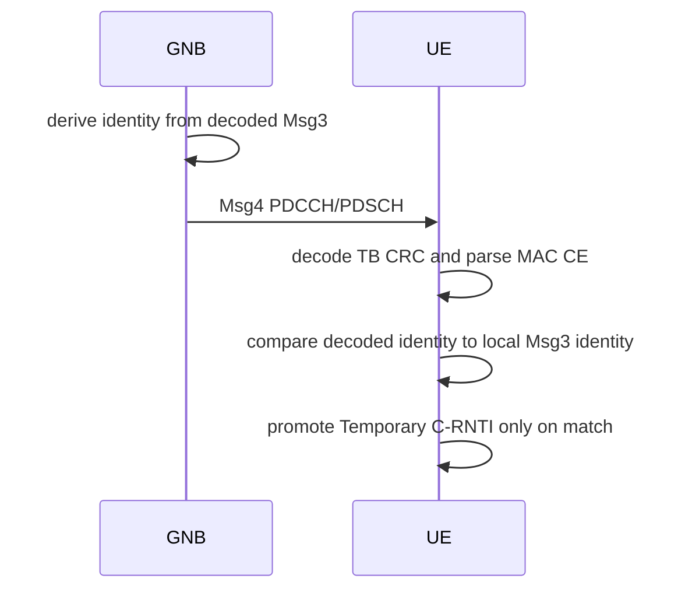

# Phase 4 Msg4 Contention Resolution

Msg4 carries contention-resolution identity and RRCSetup anchor payload evidence.
The UE promotes Temporary C-RNTI only after decoding Msg4 and matching the
decoded contention identity against its retained Msg3 identity.

## Production Path

- `+sixgr/+mac/+ra/buildMsg4ContentionResolution.m`
- `+sixgr/+phy/+ra/generateMsg4Waveform.m`
- `+sixgr/+phy/+ra/recoverMsg4Waveform.m`
- `+sixgr/+mac/+ra/parseMsg4ContentionResolution.m`

## Evidence

- `control/csv/msg4_contention_resolution.csv`
- `reports/json/msg4_contention_resolution_decoded.json`
- `reports/image/msg4_contention_resolution_flow.svg`
- `control/csv/ra_attempts.csv`

## Sequence

## Tests

- `testMsg4ContentionResolution`
- `testRANegativeMsg4IdentityMismatch`
- `testRACollisionSamePreamble`

## Current Status

Implemented for the strict anchor. Full RRCSetup ASN.1 coverage beyond the
anchor payload remains pending.
