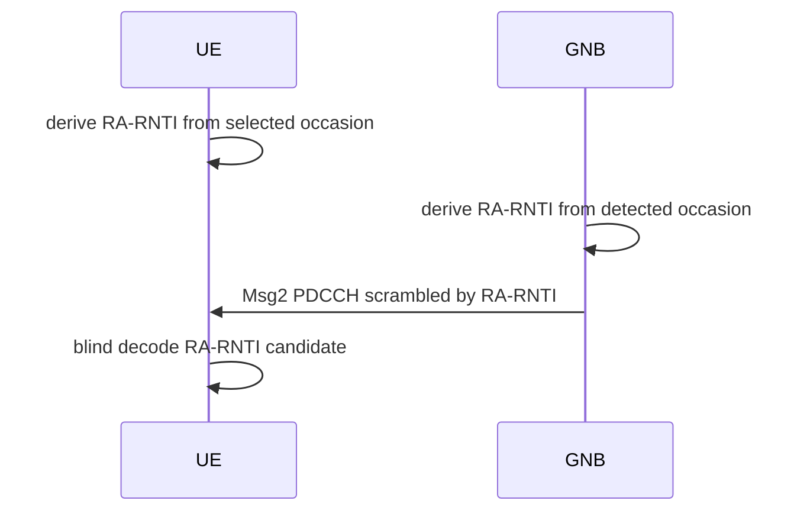

# Phase 4 RA-RNTI

RA-RNTI is derived independently from PRACH occasion components and is used for
Msg2 RAR PDCCH monitoring. The UE and gNB must agree through derived state, not
through a direct grant handoff.

## Production Path

- `+sixgr/+phy/+prach/computeRARNTIFromPRACHOccasion.m`
- `+sixgr/+phy/+ra/computeRARNTI.m`
- `+sixgr/+phy/+ra/scheduleMsg2RAR.m`
- `+sixgr/+phy/+ra/blindDecodeRARPDCCH.m`

## Evidence

- `control/csv/msg1_prach_detection.csv`
- `control/csv/msg2_pdcch_candidates.csv`
- `control/csv/msg2_rar_trials.csv`
- `control/csv/ra_attempts.csv`

## Sequence

## Tests

- `testPRACHMultiOccasionRARNTI`
- `testMsg2RARWaveformDecode`
- `testRANegativeWrongRARNTI`

## Current Status

Implemented for the strict anchor. Full multi-carrier and all time/frequency
index boundary tests remain future coverage.
