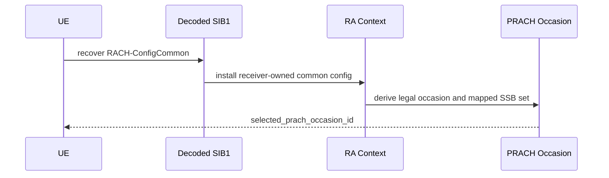

# Phase 4 SSB To RACH Occasion Mapping

Phase 4 treats SSB-to-RO association as receiver-owned state derived after
decoded SIB1 installation. The current implementation covers the strict anchor
profile used by `lls_ra_four_step_strict_mini_anchor` and fails closed outside
that supported profile.

## Production Path

- `+sixgr/+mac/+ra/installDecodedSIB1RACHConfig.m`
- `+sixgr/+phy/+ra/buildPRACHConfigFromRACHCommon.m`
- `+sixgr/+rach/mapPRACHToOccasion.m`
- `+sixgr/+phy/+prach/computeRARNTIFromPRACHOccasion.m`

## Evidence

- `control/csv/rach_config_from_decoded_sib1.csv`
- `control/csv/msg1_prach_detection.csv`
- `control/csv/ra_attempts.csv`
- `reports/csv/phase4_decoded_config_ownership_audit.csv`

## No-Oracle Boundary

The UE may retain its selected SSB and selected PRACH occasion as protocol
state. The gNB detector is allowed to know the configured occasion search
space, but it must not receive the selected UE, selected preamble, transmit
timing, propagation delay, transmit power, or collision truth.

## Sequence

## Tests

- `testSIB1ToFourStepRAIntegration`
- `testPRACHMultiOccasionRARNTI`
- `testMsg1PRACHWaveformDetection`

## Current Status

Implemented for the strict anchor profile. Full 38.213 SSB-to-RO mappings for
all PRACH table rows remain pending and are not claimed as Phase4Ok evidence.
