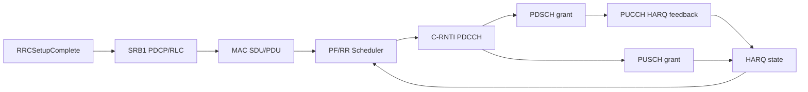
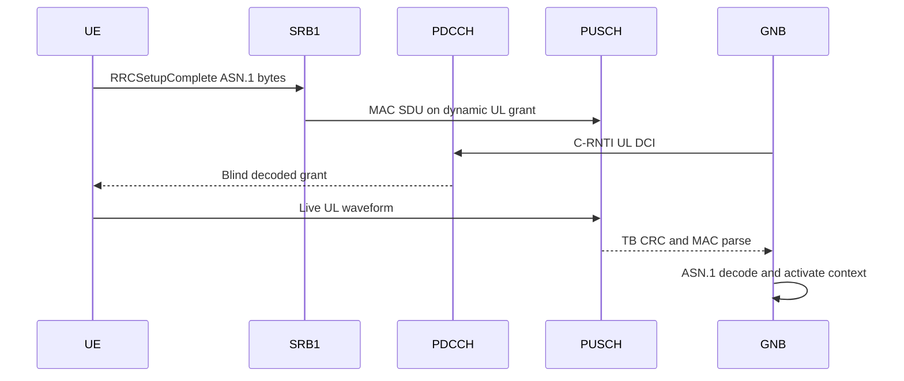
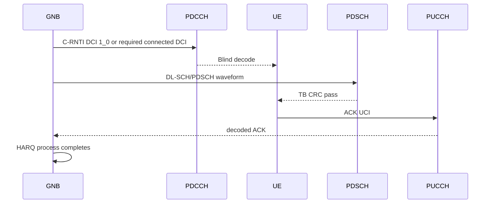
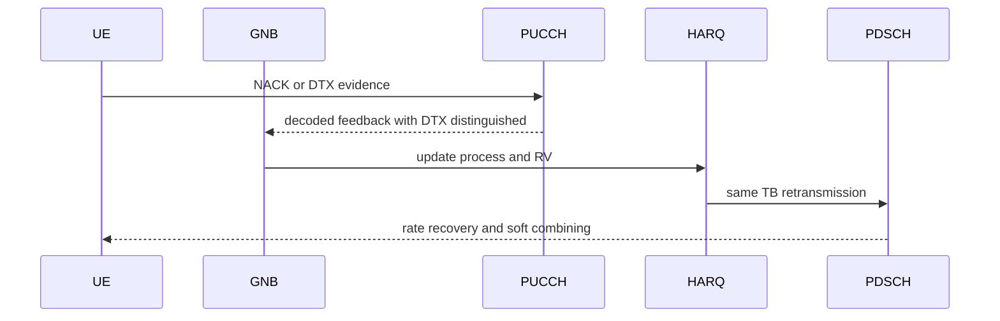
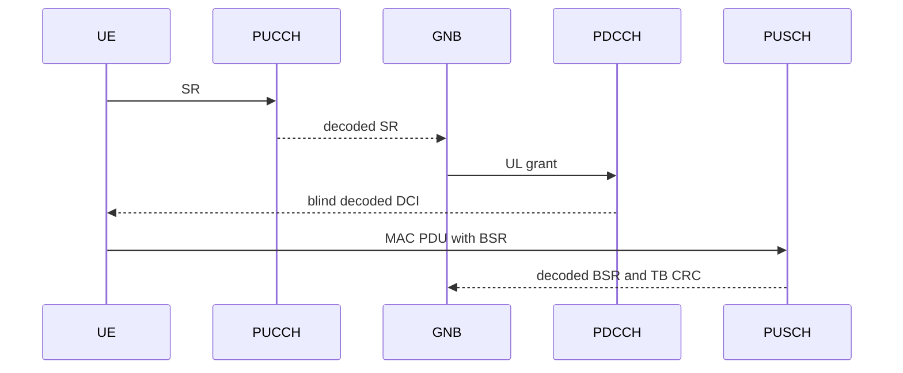
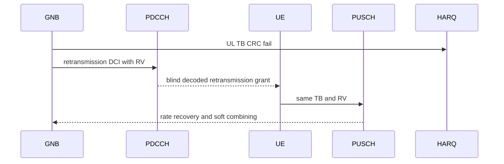
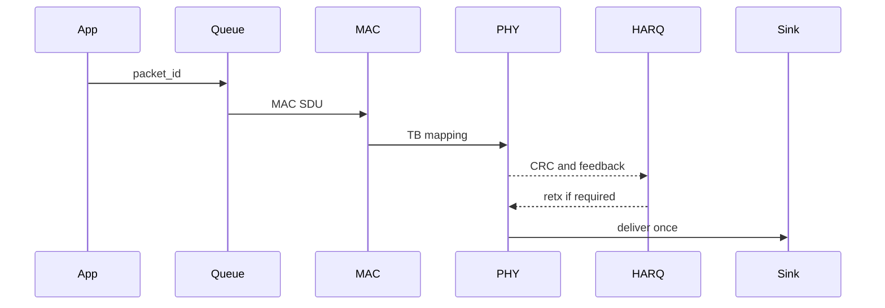

# Phase 5 Connected-Mode Architecture

Status: scaffold and baseline audit. This document does not claim Phase 5 is
complete.

The current codebase has live pieces for abstract RRC, SRB1 helper stacks,
PDCCH/PDSCH/PUSCH/PUCCH waveform blocks, MAC scheduling, HARQ state and trace
writing. The connected-mode truth gap is ownership: the UE must consume
dedicated configuration from decoded RRC, then derive DL and UL grants only from
blindly decoded C-RNTI PDCCH DCI.

## Current Boundary

`Phase5Ok` is false until every Phase 5 gate is backed by live runtime evidence.
The baseline maps under `phase5_baseline/` identify whether each surface is
live production, standalone diagnostic, configuration-only, incomplete, or
unsupported.

## Sequence A: RRCSetupComplete

Current status: pending. The existing RRC path uses simulator JSON bytes.

## Sequence B: DL New Transmission And ACK

Current status: partial. Focused PDCCH, PDSCH and PUCCH evidence exists; full
connected grant lineage is pending.

## Sequence C: DL NACK And Retransmission

Current status: partial in focused HARQ paths, pending connected packet
delivery.

## Sequence D: UL SR, BSR, Grant And New Transmission

Current status: helpers exist, connected source guard pending.

## Sequence E: UL Retransmission And Soft Combining

Current status: focused soft-combining helper exists, connected UL loop
pending.

## Sequence F: Packet Queue To Delivery

Current status: pending canonical Phase 5 packet lineage.
