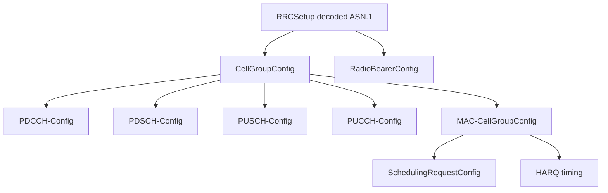

# Phase 5 Dedicated Configuration

Status: pending decoded dedicated configuration ownership.

Phase 5 requires the connected configuration to come from decoded RRCSetup
content, not from YAML oracle reads after random access. The installed
configuration must cover SRB1, UE-specific PDCCH, PDSCH, PUSCH, PUCCH, SR,
BSR, PHR when enabled, HARQ timing, and power-control fields.

Required ownership chain:

Current gap: no production installer was found that decodes and activates the
full dedicated `CellGroupConfig` at both UE and gNB for Phase 5.
