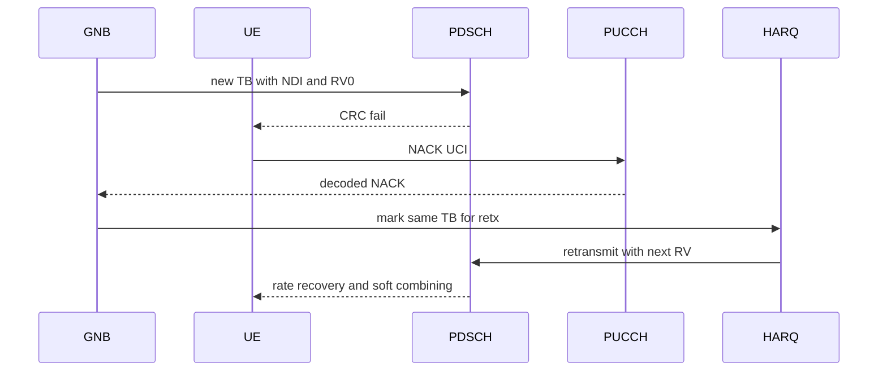

# Phase 5 DL HARQ

Status: focused HARQ evidence exists; full connected packet delivery pending.

Existing surfaces:

- `+sixgr/+l2/+mac/HARQEntity.m`
- `+sixgr/+phy/+harq/combineSoftLLR.m`
- `+sixgr/+truth/CoupledTruthRuntime.m`
- `tests/testLLSCoupledTruthHARQRoundTrip.m`
- `tests/testHARQIRCombiningGain.m`

Phase 5 requires the retransmission row to exist only if a live first
transmission failed or feedback required retransmission, the scheduler selected
a live retransmission, DCI was transmitted and decoded, the same TB state was
used, and the receiver combined rate-recovered soft information.
