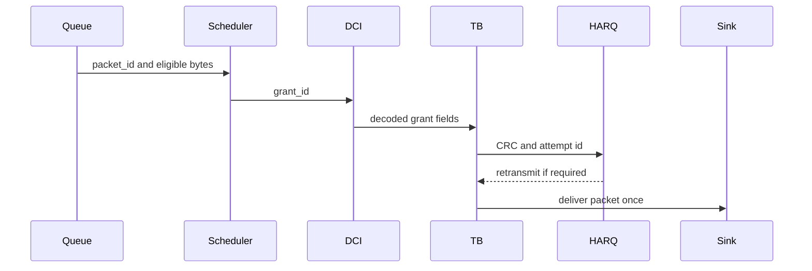

# Phase 5 Packet Lineage

Status: pending canonical connected packet delivery rows.

Phase 5 must deliver at least one DL and one UL packet per UE through the live
MAC/PHY chain, with every packet delivered exactly once. Retransmitted bytes do
not count as new delivered bytes.

Required lineage fields include:

- packet_id
- message_id
- transport_block_id
- HARQ process id
- frame, slot and symbol
- cell, UE, RNTI and direction
- queue state before and after scheduling
- grant id and decoded DCI id
- CRC outcome and HARQ outcome
- delivery, duplicate and loss status

Until this table exists from runtime rows, Phase 5 packet delivery remains
pending.
