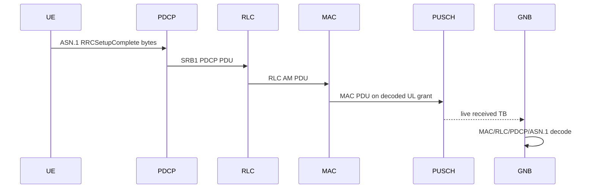

# Phase 5 RRCSetupComplete

Status: pending real ASN.1 and live PUSCH transport.

The current abstract attach stack sends `RRCSetupComplete` through SRB1 in
`+sixgr/+l3/+rrc/AttachProcedure.m`, and SRB1 uses PDCP plus RLC AM in
`+sixgr/+l3/+rrc/RRC.m`. That is useful procedure scaffolding, but it is not a
Phase 5 completion claim because `RRC.m` encodes RRC messages as UTF-8 JSON for
simulator use.

Required Phase 5 path:

Acceptance requires RRCSetupComplete encoded size, PUSCH CRC result, ASN.1
decode result and connected-context activation evidence in canonical runtime
artifacts. Until then the gate remains pending.
