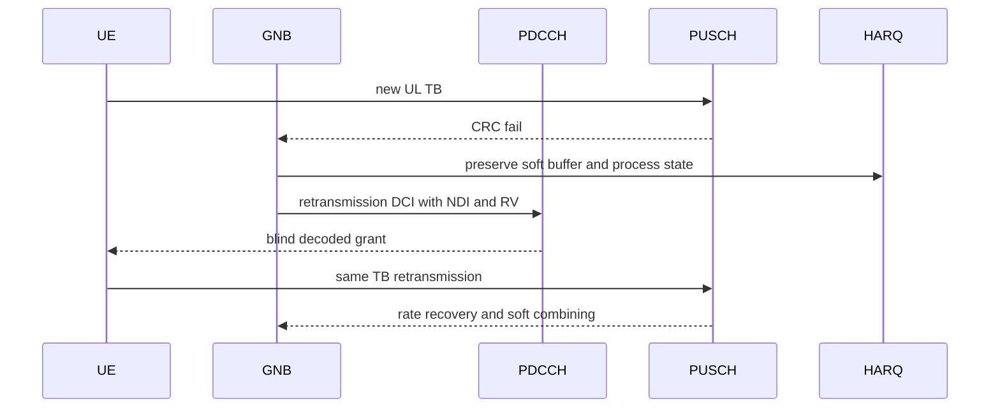

# Phase 5 UL HARQ

Status: focused HARQ surfaces exist; connected UL retransmission evidence
pending.

The scheduler must not inspect the UE UL queue directly for Phase 5 truth. UL
buffer knowledge must come from decoded SR, BSR, PHR when enabled, and permitted
protocol state.
