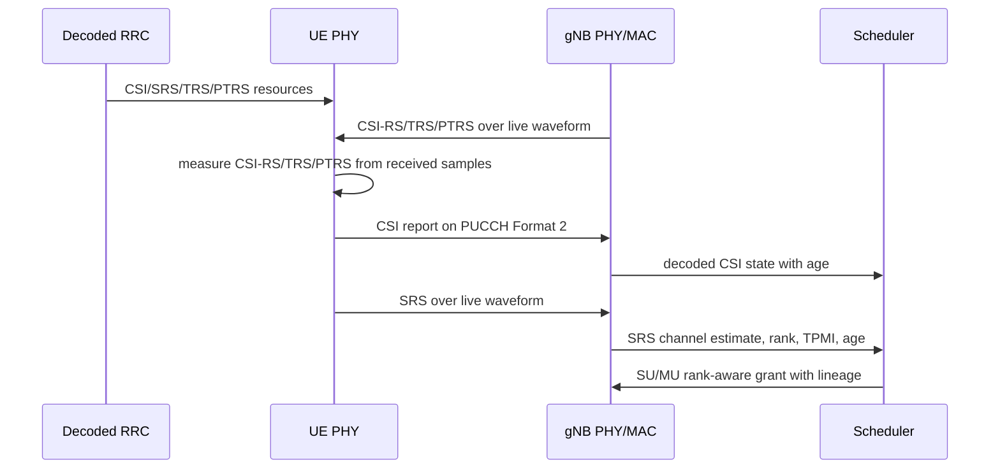

# Phase 6 Advanced PHY Architecture

Status: baseline scaffold only. This document does not claim `Phase6Ok`.

Phase 6 must connect existing strict helpers for CSI-RS, SRS, TRS, PTRS, MIMO,
and scheduler lineage into one decoded-configuration, waveform-backed runtime.
The current branch records that boundary and adds a truth-gate evaluator, but
does not yet provide the full over-air CSI report, rank-2, or MU-MIMO runtime.

Required production chain:

The scheduler must consume only decoded CSI reports, received SRS-derived state,
or other explicitly implemented over-air state. UE private measurements and true
channel tensors are post-run references only.

`Phase6Ok` is composed by `+sixgr/+runtime/Phase6TruthEvaluator.m`. Full
scenario `ResultOk` remains separately governed by root runtime, reporting,
channel/RF, KPI, duration, and issue gates.
